# Web Design Challenge for Data Analytics Bootcamp

## Latitude - Latitude Analysis Dashboard with Attitude

For this homework I created a visualisation dashboard website using graphical visualisations I generated in a past [assignment](https://github.com/sarahcasauria/python-api-challenge). Specifically, I plotted [weather data](Resources/weatherpy_cities.csv) generated from the previous assignment.

In building this dashboard, I created individual pages for each plot and a navigation bar to help navigate the website. These pages contain the visualisations and their corresponding explanations. I also have a landing page, a page where we can see a comparison of all of the plots, and another page where we can view the data used to build them.

In this challenge, I used [Bootstrap v4.6.1](https://cdn.jsdelivr.net/npm/bootstrap@4.6.1/dist/css/bootstrap.min.css), and my own [style.css](style.css) file for extra customisation.

### Website Requirements

For reference, see the ["Screenshots" section](#screenshots) below.

The website consists of 7 pages total, including:

* A [landing page](#landing-page) containing:
  * An explanation of the project.
  * Links to each visualizations page within a sidebar containing preview images of each plot. Clicking an image should take the user to that visualisation.
* Four [visualisation pages](#visualisation-pages), each with:
  * A descriptive title and heading tag.
  * The plot itself for the selected comparison.
  * A paragraph describing the plot and its significance (if any).
* A ["Comparisons" page](#comparisons-page) that:
  * Contains all of the visualizations on the same page so we can easily visually compare them.
  * Uses a Bootstrap grid for the visualizations.
    * The grid is two visualizations across on screens medium and larger, and 1 across on extra-small and small screens.
* A ["Data" page](#data-page) that:
  * Displays a responsive table containing the data used in the visualizations.
    * The table is a bootstrap table component.
    * The data from the `.csv` file was exported as a HTML file using Pandas.

The website, at the top of every page, has a navigation menu that:

* Has the name of the site on the left of the navigation bar which allows users to return to the landing page from any page.
* Contains a dropdown menu on the right of the navbar named "Plots" that provides a link to each individual visualisation page.
* Provides two more text links on the right: "Comparisons", which links to the comparisons page, and "Data", which links to the data page.
* Is responsive. The nav must have similar behavior as the screenshots ["Navigation Menu" section](#navigation-menu) (notice the background color change).

### Screenshots

This section contains screenshots of each page that was built, at varying screen widths.

#### Landing page

Large screen:

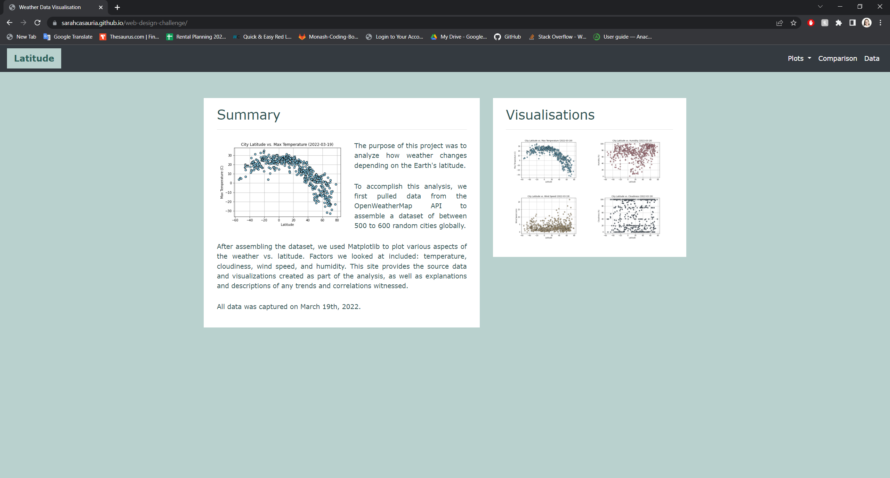

Small screen:

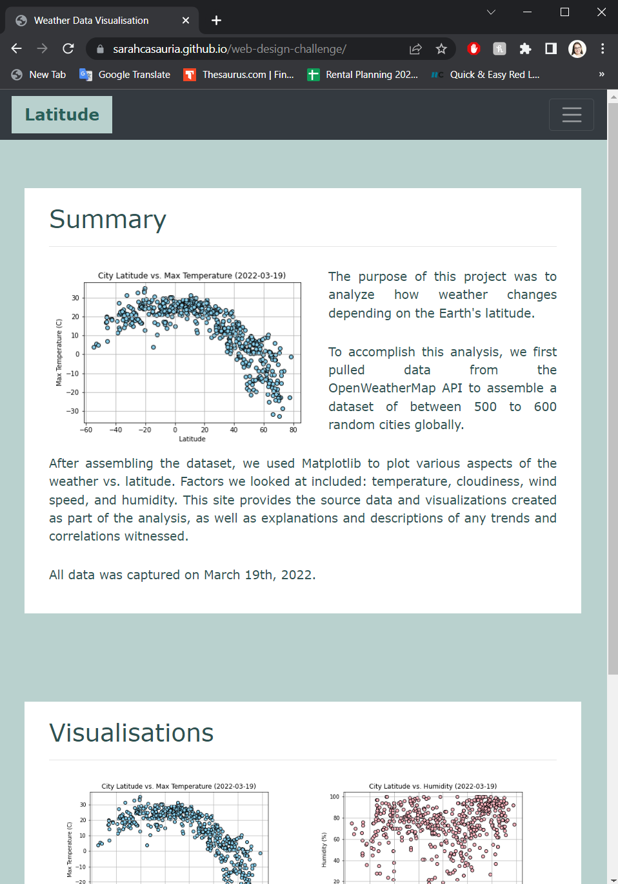


#### Comparisons page

Large screen:

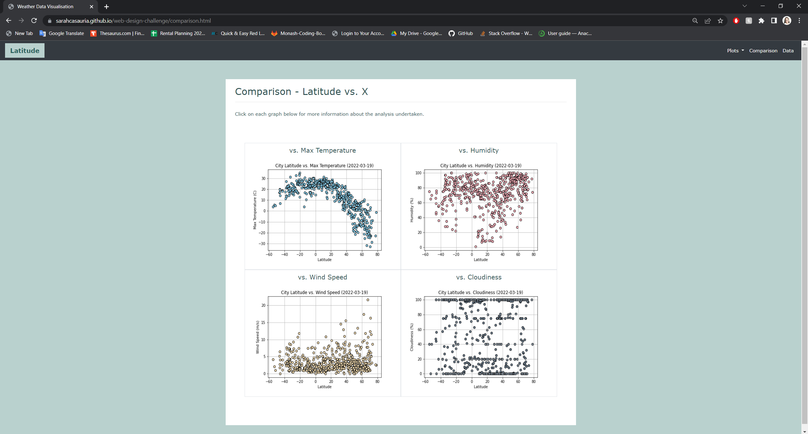

Small screen:

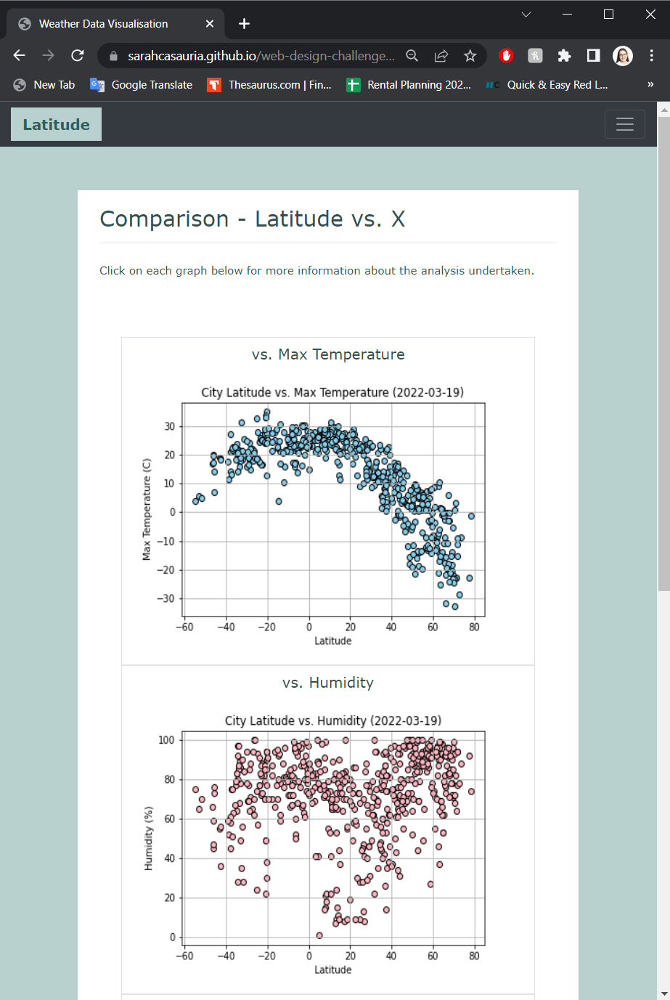

#### Data page

Large screen:

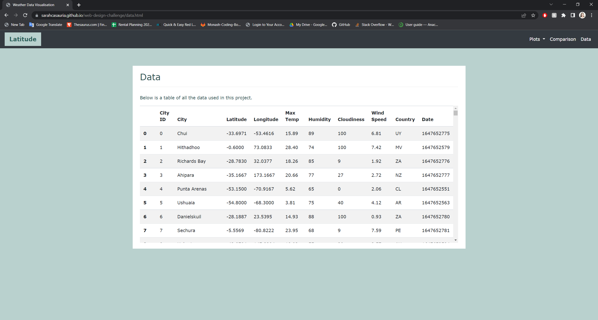

Small screen:

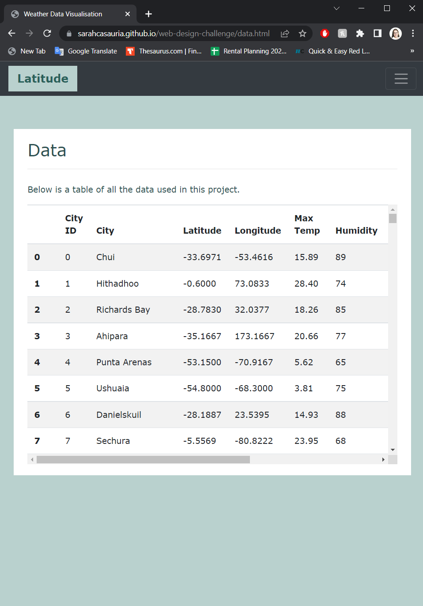

#### Visualisation pages

Max Temperature - Large screen:

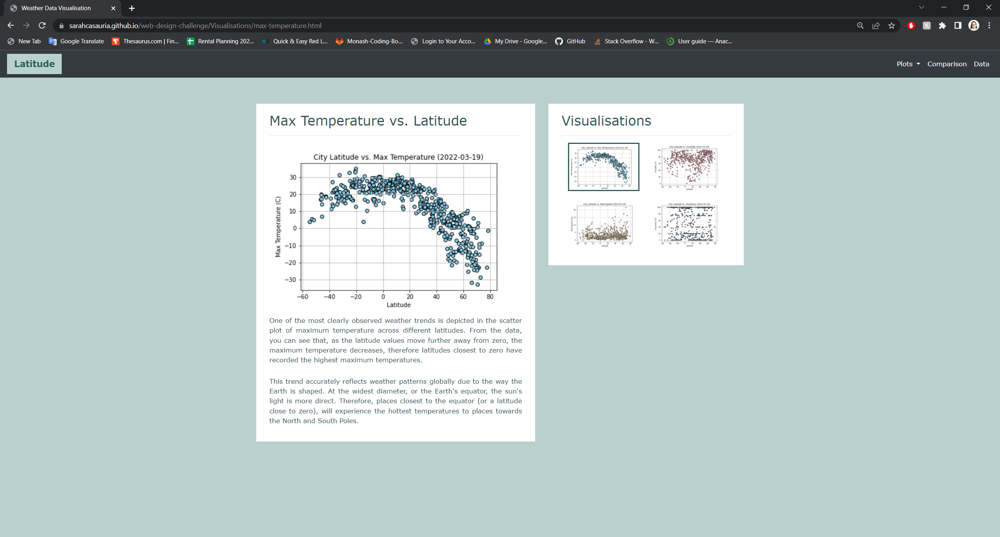

Small screen:

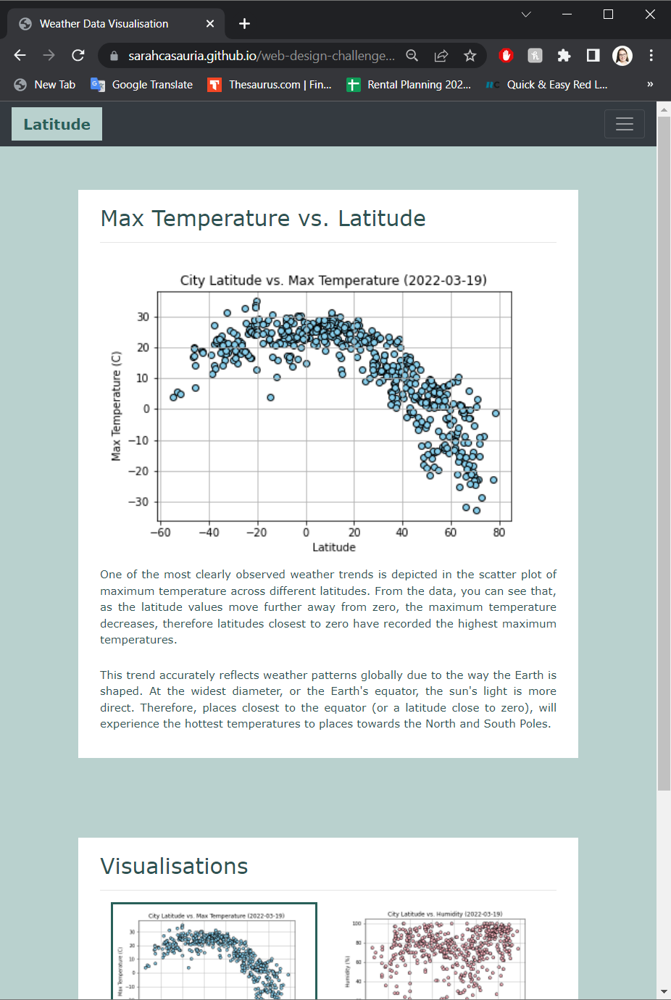

Humidity - Large screen:

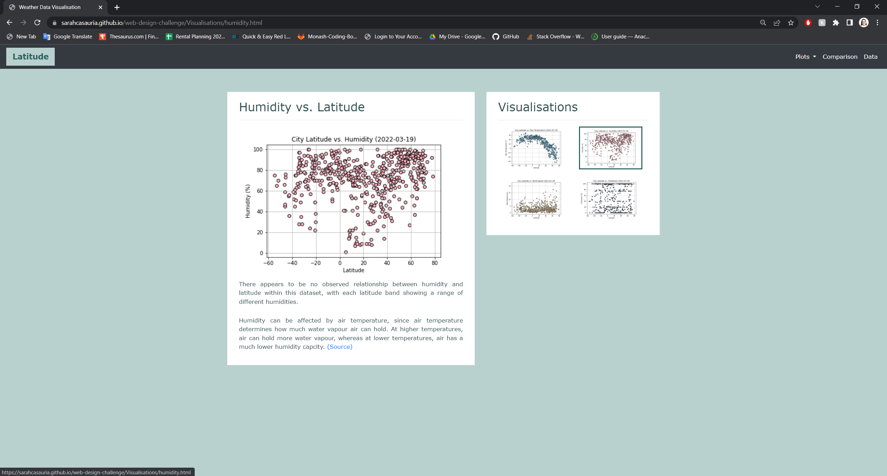

Small screen:

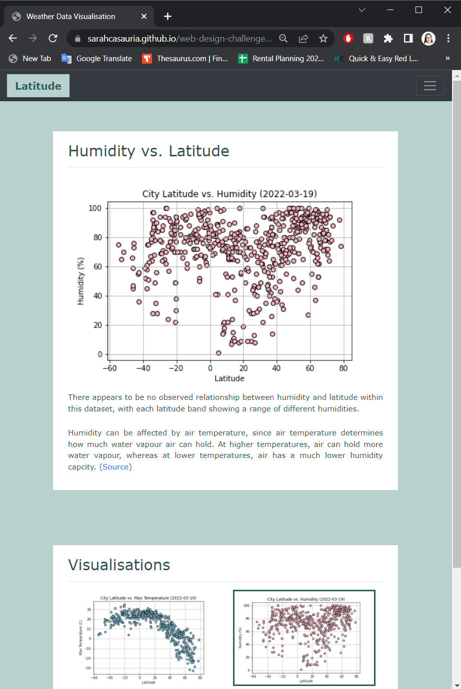

Cloudiness - Large screen:

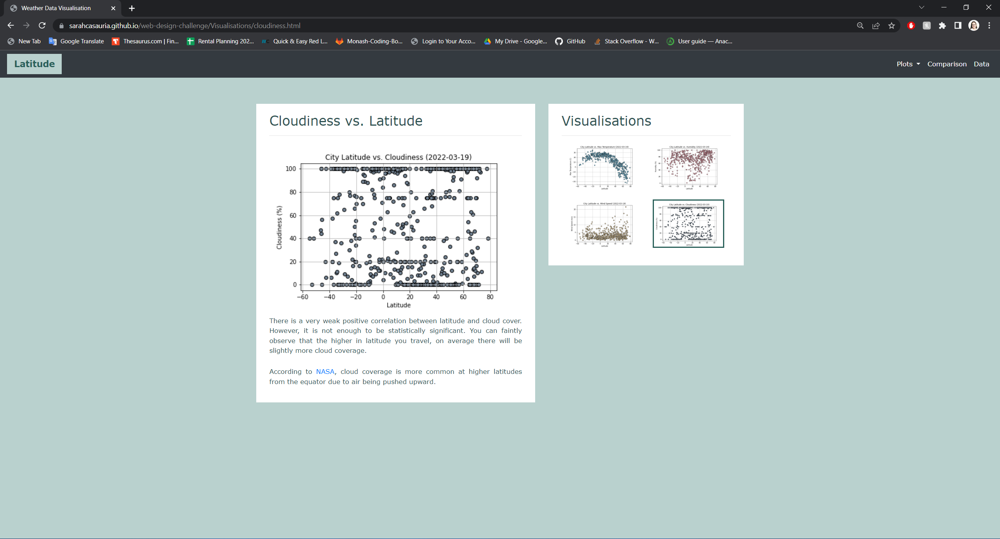

Small screen:

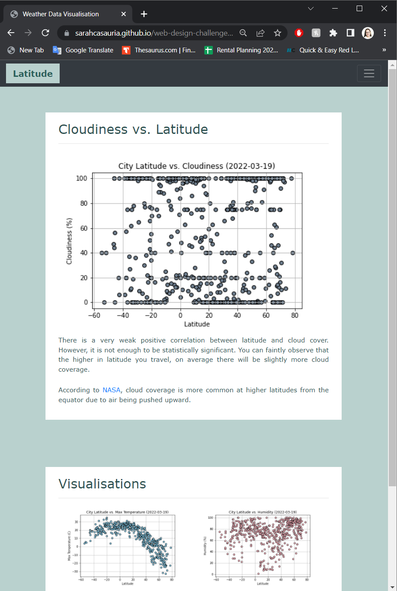

Wind Speed - Large screen:

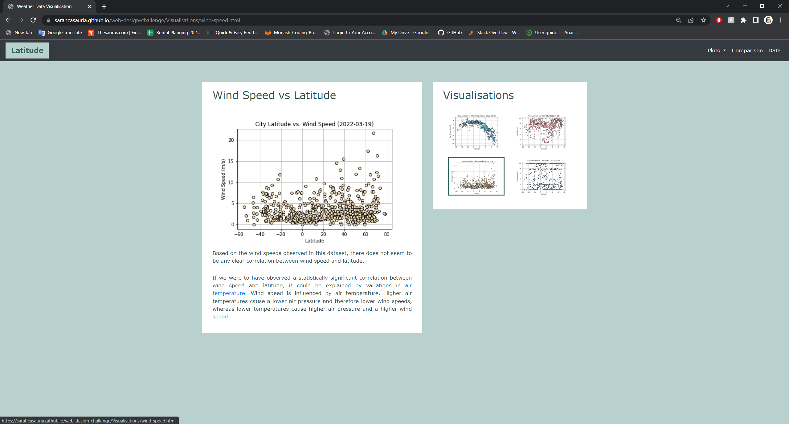

Small screen:

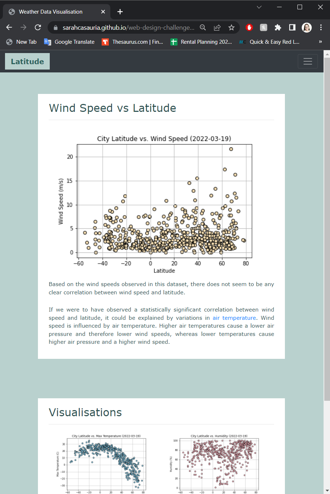

#### Navigation menu

Large screen:
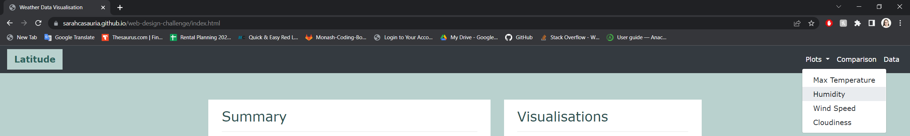

Small screen:
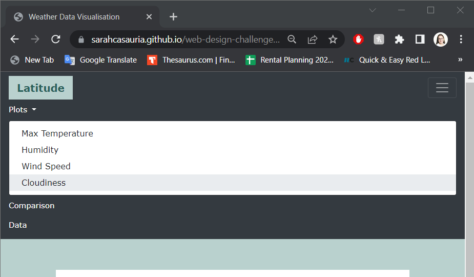

## References

OpenWeatherMap.org. (2012). Сurrent weather and forecast. Retrieved from [https://openweathermap.org/](https://openweathermap.org/)

- - -

© 2021 Trilogy Education Services, LLC, a 2U, Inc. brand. Confidential and Proprietary. All Rights Reserved.
